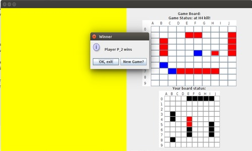
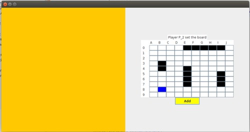
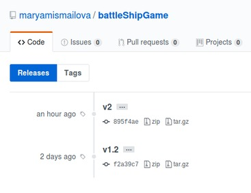
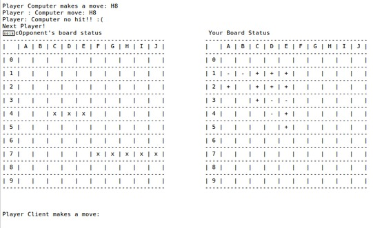
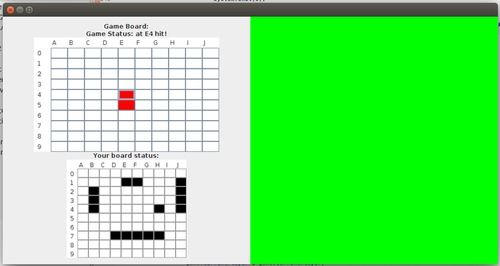

# Battleship Game Project

BattleShip game written in Java for Software Engineering class.

## How to play
#### Goal of the game:
    - Sink all of the opponent's ships.
#### Game setup:
    - Each player places his/her ships on the grid.
    - Ships: **5 ships of 5,4,3,2,1 cells**; placed vertically or horizontally on a 10x10 grid.

#### Rules:
    - Take turns firing shots by clicking on cells.
    - In case of hit continue till you win, or till you miss, and switch two second player.

### Versions:
To run the project see in releases section v1.2 and v2 for two versions of the game.
**v1.2** - completeConsole:
  The game played on 1 terminal by 2 players, or one player with a computer bot.
**v2** - 2Pl1GUI:
  The game played by 2 players, or 1 player with a bot on 1 GUI frame, abstraction of separate players by switching between player panels.

### Features
- [x] Console Version (2 Players, Bot player)
- [x] Swing GUI Version (2 Players, Bot Player)
- [ ] LAN Version (To be developed)

 
 

### Branches:
*completeConsole* and *2Pl1GUI* are the holders for the two versions of the game. (2Pl1GUI has both versions within itself).

### Installing:
See releases section, download zip or tar.gz file of the the project.
Open the downloaded project folder in one of Java IDE's that you use.
For v1.2 : run GameClass.java
For v2 : run GameFrame.java

### Authors:

    Maryam Ismayilova - L2 Computer Science student in French-Azerbaijani University
    Naila Ibrahimova - L2 Computer Science student in French-Azerbaijani University

### Acknowledgments:
    Google and Stackoverflow
